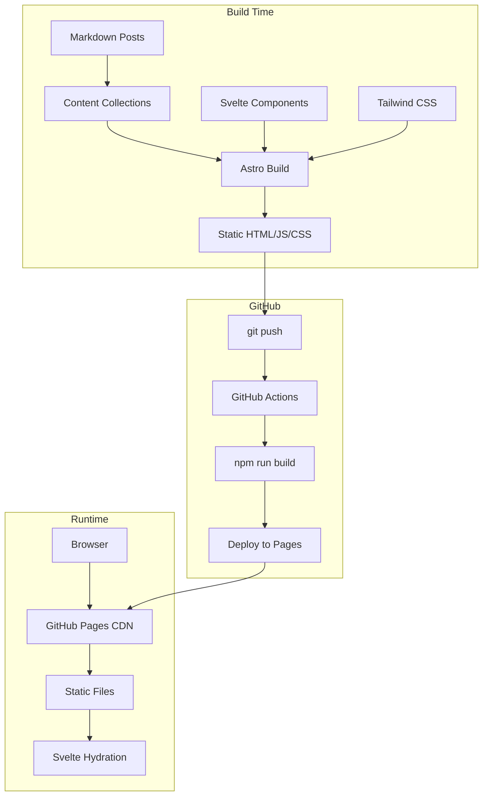
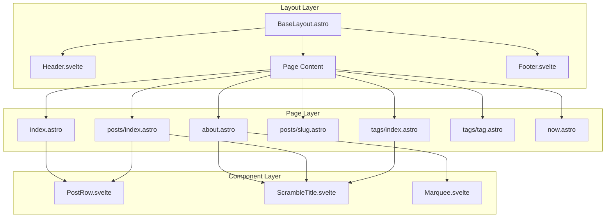
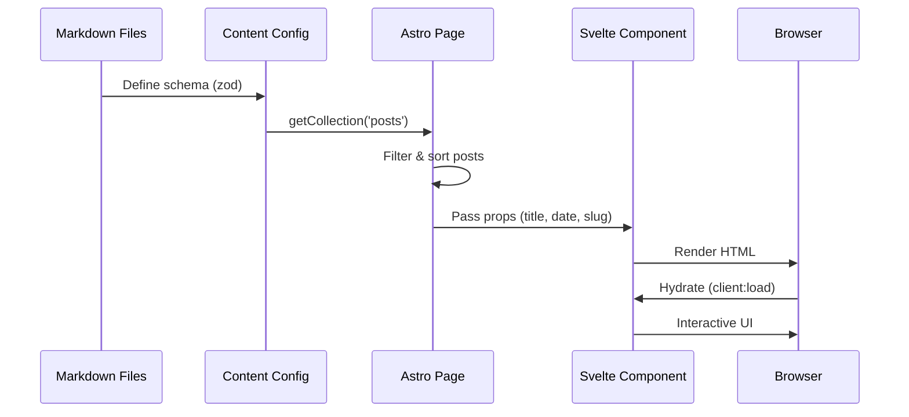
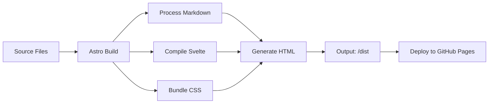

# Architecture Documentation

## System Overview

heyhido.com is a modern static blog/portfolio built with Astro and Svelte 5, deployed on GitHub Pages.

## Technology Stack

| Layer | Technology | Purpose |
|-------|------------|---------|
| Framework | Astro 5.x | Static site generation, routing |
| UI Components | Svelte 5 | Interactive client-side components |
| Styling | Tailwind CSS 4.x | Utility-first CSS |
| Content | Markdown | Blog posts with frontmatter |
| Deployment | GitHub Actions | CI/CD to GitHub Pages |
| Hosting | GitHub Pages | Static hosting with custom domain |

## Architecture Diagram



## Component Architecture



## Data Flow



## Directory Structure

```
/
├── src/
│   ├── components/
│   │   ├── blog/
│   │   │   └── PostRow.svelte      # Blog post list item
│   │   ├── layout/
│   │   │   ├── Header.svelte       # Navigation + theme toggle
│   │   │   └── Footer.svelte       # Social links + copyright
│   │   └── ui/
│   │       ├── Marquee.svelte      # Scrolling text banner
│   │       └── ScrambleTitle.svelte # Animated page titles
│   ├── content/
│   │   └── posts/                  # Markdown blog posts
│   ├── layouts/
│   │   └── BaseLayout.astro        # Main HTML wrapper
│   ├── lib/
│   │   └── utils/
│   │       └── index.ts            # Utility functions (cn)
│   ├── pages/
│   │   ├── index.astro             # Homepage
│   │   ├── about.astro             # About page
│   │   ├── now.astro               # /now page
│   │   ├── 404.astro               # Error page
│   │   ├── rss.xml.ts              # RSS feed
│   │   ├── posts/
│   │   │   ├── index.astro         # All posts
│   │   │   └── [...slug].astro     # Individual post
│   │   └── tags/
│   │       ├── index.astro         # All tags
│   │       └── [tag].astro         # Posts by tag
│   └── styles/
│       └── global.css              # Theme + animations
├── public/
│   ├── favicon.svg
│   └── images/
├── astro.config.mjs                # Astro configuration
├── svelte.config.js                # Svelte configuration
├── tsconfig.json                   # TypeScript configuration
└── package.json                    # Dependencies
```

## Routing

| Route | File | Type | Description |
|-------|------|------|-------------|
| `/` | `index.astro` | Static | Homepage with hero + recent posts |
| `/about` | `about.astro` | Static | Bio, image, marquee |
| `/now` | `now.astro` | Static | Current activities |
| `/posts` | `posts/index.astro` | Static | All posts grouped by year |
| `/posts/[slug]` | `posts/[...slug].astro` | Dynamic | Individual blog post |
| `/tags` | `tags/index.astro` | Static | All tags with counts |
| `/tags/[tag]` | `tags/[tag].astro` | Dynamic | Posts filtered by tag |
| `/rss.xml` | `rss.xml.ts` | Generated | RSS feed |
| `/404` | `404.astro` | Static | Not found page |

## Content Schema

```typescript
// src/content.config.ts
const posts = defineCollection({
  loader: glob({ pattern: '**/*.md', base: './src/content/posts' }),
  schema: z.object({
    title: z.string(),
    date: z.coerce.date(),
    author: z.string().default('Hido'),
    tags: z.array(z.string()).default([]),
    draft: z.boolean().default(false),
    description: z.string().optional(),
  }),
});
```

## Build Process



## Performance Considerations

1. **Static Generation**: All pages pre-rendered at build time
2. **Partial Hydration**: Only interactive components use `client:load`
3. **CSS Optimization**: Tailwind purges unused styles
4. **Font Loading**: Geist Sans loaded from local package
5. **Image Optimization**: Static images in `/public`
6. **Smooth Scrolling**: Lenis library for smooth scroll experience

## Security

- No server-side code (fully static)
- No database connections
- No user authentication
- Content served over HTTPS via GitHub Pages
- Custom domain with SSL certificate
